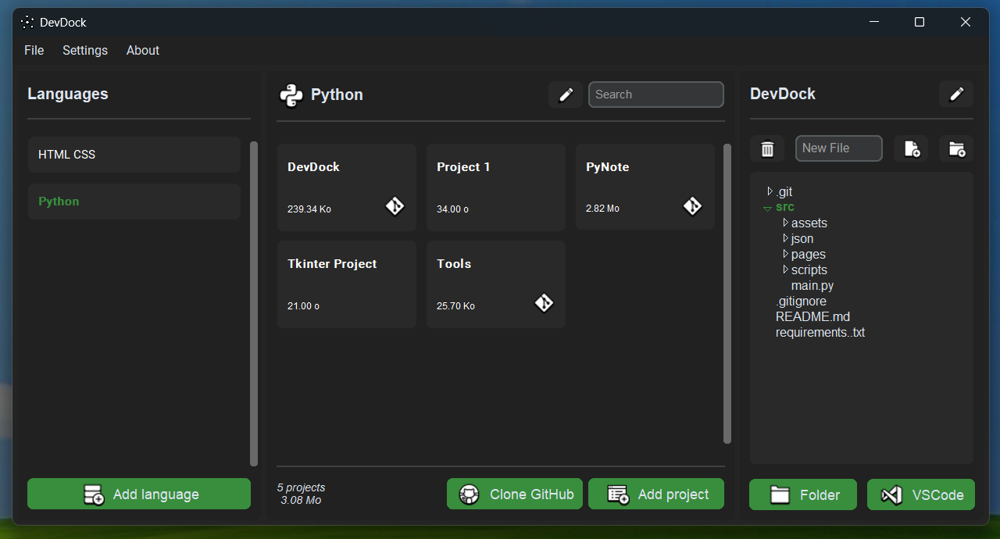
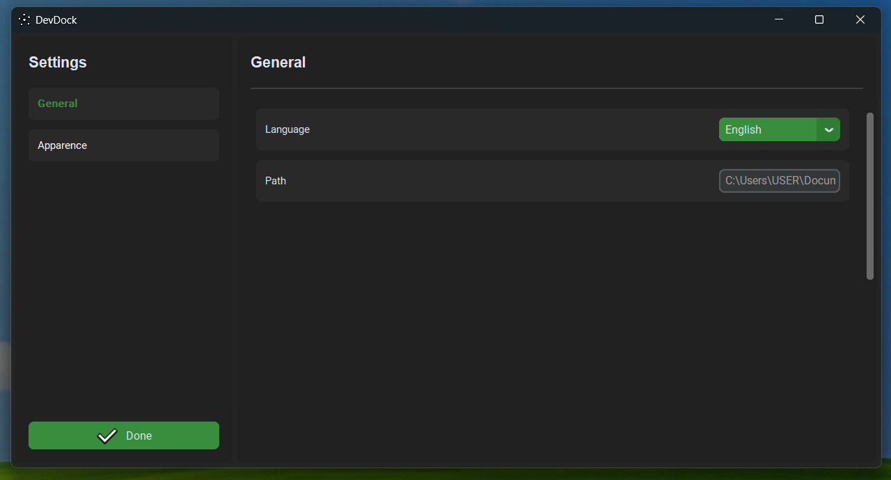

<div align="center">
  
# [DevDock]
***A Python application designed to organize project files by language, <br>offering a clear and visual interface for easy management of your documents.***

[](https://github.com/MadeByRoucoule/DevDock/commits/main/)
[](https://github.com/MadeByRoucoule/DevDock)

 

</div>

## 🎭 Clone the repository:
```
git clone https://github.com/MadeByRoucoule/DevDock.git
cd DevDock
```

## 📦 Install the required dependencies:
```
pip install -r requirements.txt
```

> [!IMPORTANT]
> **🚀 Project in development!**

[DevDock]: https://github.com/MadeByRoucoule/DevDock
